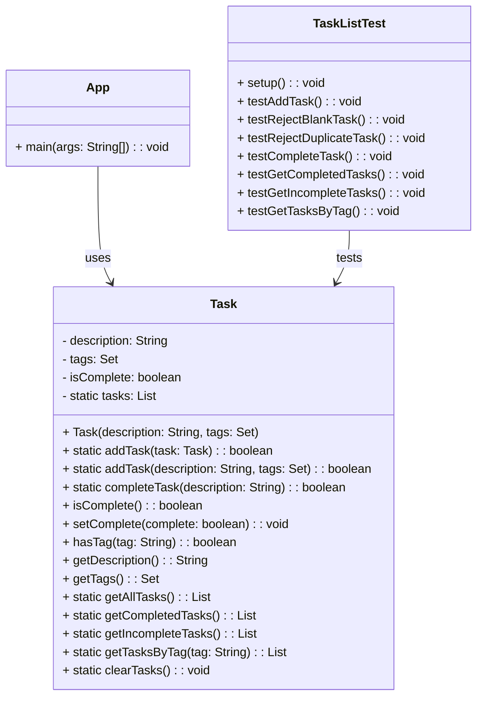

```mermaid
classDiagram
    class App {
        + main(args: String[]): void
    }

    class Task {
        - description: String
        - tags: Set<String>
        - isComplete: boolean
        - static tasks: List<Task>
        + Task(description: String, tags: Set<String>)
        + static addTask(task: Task): boolean
        + static addTask(description: String, tags: Set<String>): boolean
        + static completeTask(description: String): boolean
        + isComplete(): boolean
        + setComplete(complete: boolean): void
        + hasTag(tag: String): boolean
        + getDescription(): String
        + getTags(): Set<String>
        + static getAllTasks(): List<Task>
        + static getCompletedTasks(): List<Task>
        + static getIncompleteTasks(): List<Task>
        + static getTasksByTag(tag: String): List<Task>
        + static clearTasks(): void
    }

    class TaskListTest {
        + setup(): void
        + testAddTask(): void
        + testRejectBlankTask(): void
        + testRejectDuplicateTask(): void
        + testCompleteTask(): void
        + testGetCompletedTasks(): void
        + testGetIncompleteTasks(): void
        + testGetTasksByTag(): void
    }

    App --> Task : uses
    TaskListTest --> Task : tests
```